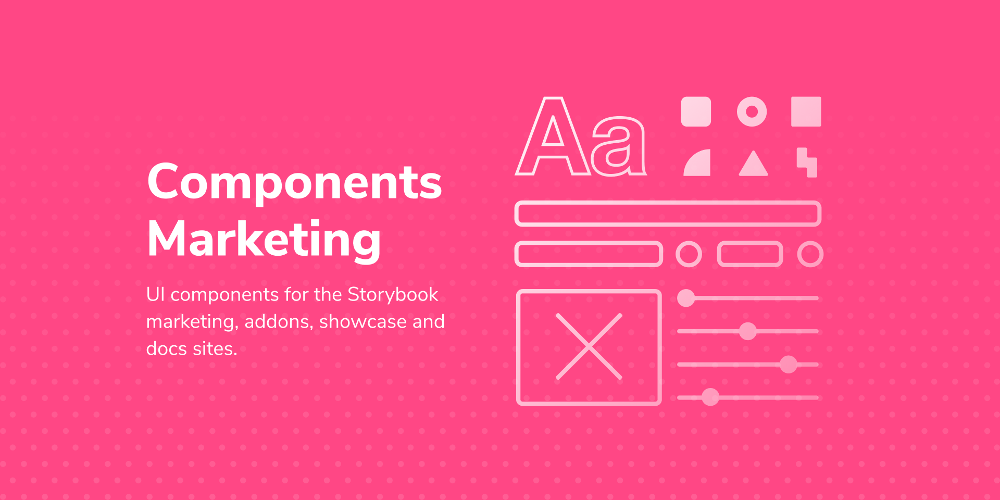

# Storybook Marketing Component Library

UI components for the Storybook marketing, docs, addons, blog and showcase sites.



[](https://www.npmjs.com/package/@storybook/components-marketing) [](https://standardjs.com)

## Used by

- [Storybook homepage](https://storybook.js.org/)
- [Tutorials](https://www.learnstorybook.com/)
- [Blog](https://storybook.js.org/blog/)
- [Component Encyclopedia](https://storybook.js.org/showcase/)

Note: these components are not used in Storybook's UI.

## Tech stack

Building components

- 📚 [Storybook](https://storybook.js.org) for UI component development and [auto-generated docs](https://medium.com/storybookjs/storybook-docs-sneak-peak-5be78445094a)
- 👩‍🎤 [Storybook theming |](https://emotion.sh/) for component-scoped styling
- ⚛️ [React](https://reactjs.org/) declarative component-centric UI

Maintaining the system

- 📦 [NPM](https://www.npmjs.com/) for [packaging and distribution](https://blog.hichroma.com/how-packaging-makes-it-dead-simple-to-share-ui-components-29912593539d)
- ✅ [Chromatic](https://www.chromatic.com/) to prevent UI bugs in components (by Storybook maintainers)
- 🚥 [CircleCI](https://circleci.com/) Continuous integration

## Install

```bash
npm install --save @storybook/components-marketing
```

Install peer dependencies:

```bash
npm install --save @docsearch/css @storybook/theming framer-motion
```

## Usage — global header and footer

The page header comprises of three parts: [Eyerbrow](https://main--62acb38c42e6ab9f79be20d5.chromatic.com/?path=/story/eyebrow--default), [Nav](https://main--62acb38c42e6ab9f79be20d5.chromatic.com/?path=/story/nav-nav--default), and [SubNav](https://main--62acb38c42e6ab9f79be20d5.chromatic.com/?path=/story/subnav-subnav--tab-linklist)

`Eyebrow`, `Nav`, and [Footer](https://main--62acb38c42e6ab9f79be20d5.chromatic.com/?path=/story/footer-footer--default) usually live at the shared layout level whereas the `SubNav` is specific to each page. The SubNav can be configured in several different ways, check out its [stories file](src/components/SubNav/SubNav.stories.tsx) for examples.

All these components support an `inverse` variant.

### Sourcing data

Source shared DX data from https://storybook-dx.netlify.app/.netlify/functions/dx-data

- Eyerbrow requires `latestPost`
- Footer requires `subscriberCount`

### Configuring links

The Nav and Footer links are configured via the [LinksContextProvider](src/components/links-context.ts). It comes with a default set of [links](src/components/links-context.ts#L29)

https://storybook-dx.netlify.app/.netlify/functions/dx-data

### Styling

`Eyebrow` contains a `Search` component which depends on `@docsearch/css`. You need to load these styles in your app, probably at the top-most, global, level:

```js
import '@docsearch/css';
```

## Development Scripts

#### `yarn release`

> Bump the version

> Push a release to GitHub and npm

> Push a changelog to GitHub

_Notes:_

- Requires authentication with [`npm adduser`](https://docs.npmjs.com/cli/adduser.html)
- [`auto`](https://github.com/intuit/auto) is used to generate a changelog and push it to GitHub. In order for this to work correctly, **environment variables called `GH_TOKEN` and `NPM_TOKEN` are needed** that reference a [GitHub personal access token](https://help.github.com/en/articles/creating-a-personal-access-token-for-the-command-line) and a [NPM "Publish" token](https://docs.npmjs.com/creating-and-viewing-access-tokens) with the appropriate permissions to update the repo.

## License

MIT © [storybookjs](https://github.com/storybookjs)
